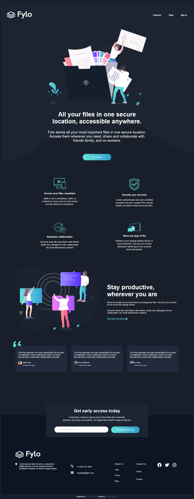

# Frontend Mentor - Fylo dark theme landing page solution

This is a solution to the [Fylo dark theme landing page challenge on Frontend Mentor](https://www.frontendmentor.io/challenges/fylo-dark-theme-landing-page-5ca5f2d21e82137ec91a50fd). Frontend Mentor challenges help you improve your coding skills by building realistic projects. 

## Table of contents

- [Overview](#overview)
  - [The challenge](#the-challenge)
  - [Screenshot](#screenshot)
  - [Links](#links)
- [My process](#my-process)
  - [Built with](#built-with)
  - [What I learned](#what-i-learned)
  - [Continued development](#continued-development)
  - [Useful resources](#useful-resources)
- [Author](#author)
- [Acknowledgments](#acknowledgments)

### The challenge

Users should be able to:

- View the optimal layout for the site depending on their device's screen size
- See hover states for all interactive elements on the page

### Screenshot

- screenshot of my solution in the images folder named my-solution.png

###links

- Solution URL: https://github.com/hollumighty/SIDEHUSTLE
- Live Site URL: https://app.netlify.com/sites/wonderful-visvesvaraya-cc0c81/overview

## My process

adding semantics to the HTML
styling with CSS
uploading 

### Built with

- Semantic HTML5 markup
- CSS custom properties
- Flexbox
- CSS Grid
- Mobile-first workflow

### What I learned

I learnt how to use css grid and flexbox to build responsive websites

-Example

--css flex sample

.sign-up {
    display: flex;
    flex-direction: column;
    align-items: center;
    justify-content: center;
    padding: 5px 60px 30px 60px;
    border-radius: 5px;
    position: absolute;
    left: 50%;
    transform: translateX(-50%);
    bottom: -155px;
    background: var(--intro-email-bg);

}

--css grid sample

.main-content {
    display: grid;
    grid-template-columns: repeat(2, 1fr);
    gap: 95px 100px; 
    margin: 100px 0;
    padding: 0 200px;
    align-content: center;
    justify-items: center;

}

### Continued development

i will like to continue lesrning more about flexboss, css grids and css in general

### Useful resources

--w3schools 
this helped me a lot with CSS in general

## Author

- Website - https://app.netlify.com/sites/wonderful-visvesvaraya-cc0c81/overview
- Twitter - 

## Acknowledgments

I acknowledge Melford B. Birakor for his support on grey areas and to all open sources i used during the project

